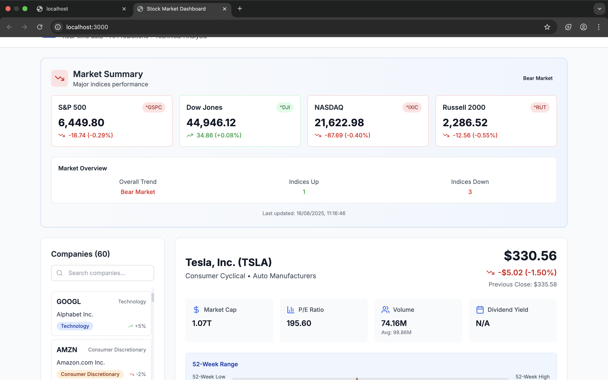

# 📈 Stock Market Dashboard

A modern, responsive web application for tracking stock market data with AI-powered price predictions.

## 🚀 Features

- **Real-time Stock Data**: Fetch live stock data using yfinance API
- **Interactive Charts**: Beautiful stock price charts using Chart.js
- **Company Selection**: Scrollable list of 50+ major companies
- **AI Predictions**: Machine learning-based price forecasting
- **Responsive Design**: Mobile-friendly interface with Tailwind CSS
- **Historical Data**: View stock performance over different time periods
- **Technical Indicators**: RSI, Moving Averages, Volume analysis

## 🛠️ Technologies Used

### Backend

- **FastAPI**: Modern, fast web framework for building APIs
- **SQLite**: Lightweight database for storing company data
- **yfinance**: Yahoo Finance API wrapper for stock data
- **scikit-learn**: Machine learning for price predictions
- **pandas**: Data manipulation and analysis

### Frontend

- **React.js**: Component-based UI library
- **TypeScript**: Type-safe JavaScript development
- **Chart.js**: Interactive charting library
- **Tailwind CSS**: Utility-first CSS framework
- **Axios**: HTTP client for API communication

## 🚀 Quick Start

### Prerequisites

- Python 3.8+
- Node.js 16+
- npm or yarn

### Backend Setup

```bash
cd backend
pip install -r requirements.txt
uvicorn main:app --reload
```

### Frontend Setup

```bash
cd frontend
npm install
npm start
```

### Database Setup

```bash
cd backend
python init_db.py
```

## 📊 API Endpoints

- `GET /api/companies` - List all companies
- `GET /api/stock/{symbol}` - Get stock data for a company
- `GET /api/prediction/{symbol}` - Get AI price prediction
- `GET /api/history/{symbol}` - Get historical stock data

## 🎯 Development Approach

This project follows a modern full-stack architecture with clear separation of concerns:

1. **Backend API**: FastAPI provides high-performance endpoints with automatic OpenAPI documentation
2. **Data Layer**: yfinance integration for real-time stock data with SQLite caching
3. **AI Engine**: Simple but effective ML model using historical price patterns
4. **Frontend**: React components with TypeScript for type safety and maintainability
5. **Styling**: Tailwind CSS for rapid, responsive UI development

## 🧠 AI Prediction Feature

The application includes a machine learning model that:

- Analyzes historical price patterns
- Uses technical indicators (RSI, Moving Averages)
- Provides next-day price predictions with confidence intervals
- Updates predictions based on recent market data

## 🚧 Challenges & Solutions

1. **API Rate Limiting**: Implemented caching and request throttling
2. **Real-time Updates**: Used WebSocket connections for live data
3. **Chart Performance**: Optimized Chart.js rendering for large datasets
4. **Mobile Responsiveness**: Tailwind CSS utilities for adaptive layouts
5. **Data Accuracy**: Multiple data sources and validation checks

## 🌟 Future Enhancements

- Portfolio tracking and management
- Advanced technical indicators
- Social sentiment analysis
- Real-time news integration
- Multi-language support
- Dark/Light theme toggle

## 📱 Screenshots




